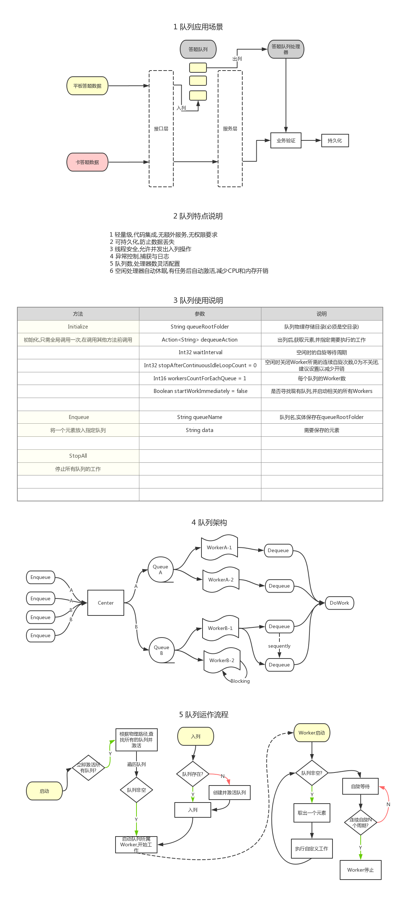

# BackgroundWorker
Windows后台工作服务框架

## Infrastructure
基础后台工作服务,各种帮助类

## Infrastructure.QueueWorker
基于持久化队列的后台工作服务框架

```cs
 Helper.RunAsBackgroundService(
                configKeyAndFieldNames: new Dictionary<string, string>
                {
                    {"CallbackUrl",nameof(_callbackUrl)},
                    {"QueueRootFolder",nameof(_queueRootFolder)}
                },
                userRights: Helper.UserRights.RUN_AS_ADMIN,
                updateInterval: 60000,
                tryBlock: () =>
                {
                    var worker = new DequeueWorker(
                            queueRootFolder: _queueRootFolder,
                            queueName: _queueName,
                            dequeueAction: (convertSetting) =>
                            {
                               //DO some work...
                            },
                            loopInterval: 1000
                         );
                    WorkerFactory.AddWorker(worker);
                    worker.Start();
                }
```

## 队列设计



## InstallGuideGen
 <li>
                该页面根据应用的<strong>config文件</strong>自动生成,默认值为<strong>config文件</strong>中的值,标题和下拉选项来自该config上方注释,如:
                <pre>&lt;!--读卡驱动模式[Service,Proxy,Remote]--&gt;<br />&lt;add key="CardReaderMode" value="Service" /&gt;</pre>
                会生成标题为"读卡驱动模式",默认值为"Service",带有"Service,Proxy,Remote"三个选项的下拉列表
            </li>
            <li>
                参数填好后点击<strong>生成链接</strong>,复制到<strong>IE浏览器</strong>安装
                其他浏览器需安装插件
                <a href="https://chrome.google.com/webstore/detail/clickonce-for-google-chro/kekahkplibinaibelipdcikofmedafmb"></a>
                <a href="https://addons.mozilla.org/en-us/firefox/addon/fxclickonce/"></a>
            </li>
            <li>
                如果以上配置有变动,在服务器上停止程序,然后用新的安装链接运行一次即可
            </li>
